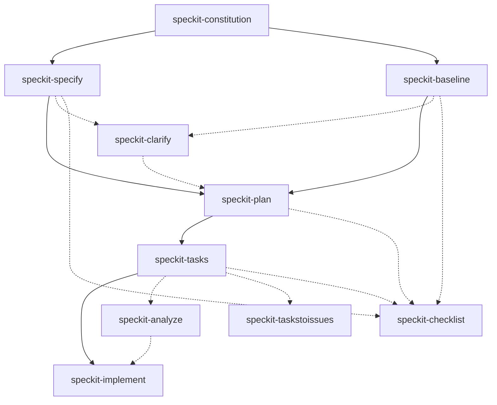

# speckit-agent-skills

Agent skills for [Spec Kit](https://github.com/github/spec-kit)

## Overview

This repository provides reusable skills and templates for multiple agent runtimes:

- **Shared skills** - Source skills live in `skills/` and are symlinked to `.claude/skills`, `.codex/skills`, and `.github/skills`
- **Claude Code** - Spec Kit commands in `.claude/commands/` (skills via the symlinked `.claude/skills`)
- **Codex CLI** - Prompt files in `.codex/prompts/` (skills via the symlinked `.codex/skills`)
- **GitHub Copilot CLI** - Agent files in `.github/agents/`, prompt files in `.github/prompts/`, skills via `.github/skills`
- **Gemini CLI** - Command files in `.gemini/commands/`
- **Spec Kit** - Spec-Driven Development workflow skills (`speckit-*`) across all runtimes

Each skill directory has a `SKILL.md` with YAML front matter that includes the skill configuration and documentation.

### Spec Kit Workflow

This repository implements the **Spec-Driven Development** methodology via Spec Kit skills. The canonical workflow:

1. **Constitution** → Define project principles
2. **Specify** → Capture feature requirements (what/why)
   - Or **Baseline** → Generate specs from existing code
3. **Clarify** (optional) → Resolve ambiguities
4. **Plan** → Create technical strategy (how)
5. **Analyze** (optional) → Validate consistency
6. **Tasks** → Generate ordered work items
7. **Implement** → Execute development

See **[AGENTS.md](./AGENTS.md#spec-kit-workflow)** for the complete workflow guide with examples and best practices.

#### Visual workflow



## Skills by runtime

### Shared skills (`skills/`)

- `speckit-*` - Spec Kit workflow skills

### Runtime access

- **Claude Code:** `.claude/commands/` (Spec Kit prompts) and `.claude/skills` (symlink to `../skills`)
- **Codex CLI:** `.codex/prompts/` (Spec Kit prompts) and `.codex/skills` (symlink to `../skills`)
- **GitHub Copilot CLI:** `.github/agents/` (Spec Kit agents), `.github/prompts/`, `.github/skills` (symlink to `../skills`)
- **Gemini CLI:** `.gemini/commands/` (Spec Kit prompts)

## Structure

```
.
├── skills/              # Source skills (speckit-*)
├── .claude/
│   ├── commands/        # Claude Code command prompts (speckit.*)
│   └── skills -> ../skills
├── .codex/
│   ├── prompts/         # Codex CLI prompt files (speckit.*)
│   └── skills -> ../skills
├── .gemini/
│   └── commands/        # Gemini CLI prompt files (speckit.*.toml)
├── .github/
│   ├── agents/          # GitHub Copilot CLI agents (speckit.*.agent.md)
│   ├── prompts/         # GitHub Copilot CLI prompts (speckit.*.prompt.md)
│   ├── skills -> ../skills
│   └── workflows/       # CI workflows (ci.yml)
└── .specify/            # Spec Kit templates and memory files
    ├── memory/
    ├── scripts/
    │   └── bash/        # Helper scripts used by skills
    └── templates/       # spec, plan, tasks, checklist, agent-file templates
```

## Prerequisites

Install and authenticate the required CLI tools before running skills:

- **Claude Code** - For `.claude/commands/` and shared skills via `.claude/skills`
- **GitHub Copilot CLI** - For `.github/agents/` and shared skills via `.github/skills`
- **OpenAI Codex CLI** - For `.codex/prompts/` and shared skills via `.codex/skills`
- **Gemini CLI** - For `.gemini/commands/`
- **Spec Kit** - Implemented via skills in this repository (no separate installation)

## Usage notes

- Skills do not always auto-run; use your agent's skill invocation flow or ask for the skill explicitly.
- If a skill fails, open its `SKILL.md` and verify prerequisites and command syntax.
- Spec Kit helper scripts live in `.specify/scripts/bash` (bash-only). Run them from repo root and prefer their `--json` output (absolute paths).

## Contributing

See [AGENTS.md](./AGENTS.md) for repository guidelines and agent-specific rules.

## License

See [LICENSE](./LICENSE) for details.
